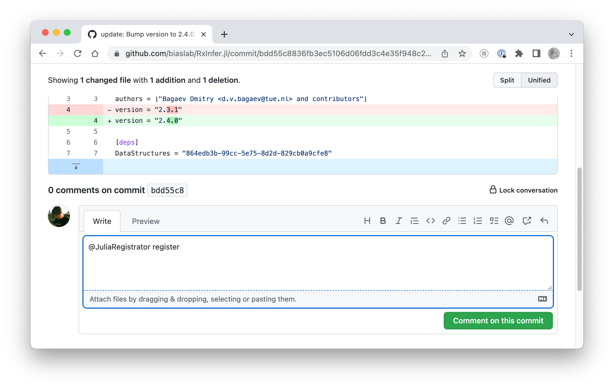

# [Publishing a new release](@id contributing-new-release)

Please read first the general [Contributing](@ref contributing-overview) section.
Also, please read the [FAQ](https://github.com/JuliaRegistries/General#faq) section in the Julia General registry.

## Start the release process

In order to start the release process a person with the necessary permissions should:

- Update the version in the following files 
  + `Project.toml` (1 place, under `version`)
  + `codemeta.json` (2 places, under `version` and `softwareVersion`)
- Ensure that `CHANGELOG.md` has been properly maintained and up to date
  + Change the `Unreleased` section to the new version, set the date
  + Add new `Unreleased` section
  + Update the very bottom of the CHANGELOG with new diffs
- If necessary make a new commit that will be registered and tagged as a new version
- Open a commit page on GitHub
- Write the `@JuliaRegistrator register` comment for the commit:

The Julia Registrator bot should automatically register a request for the new release. Once all checks have passed on the Julia Registrator's side, the new release will be published and tagged automatically.
