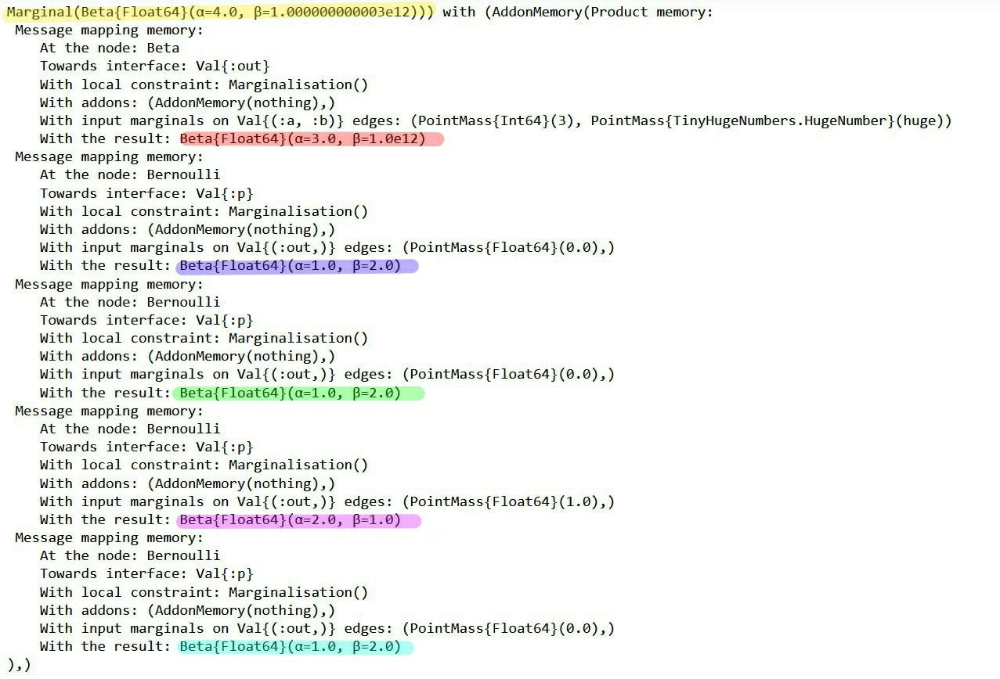
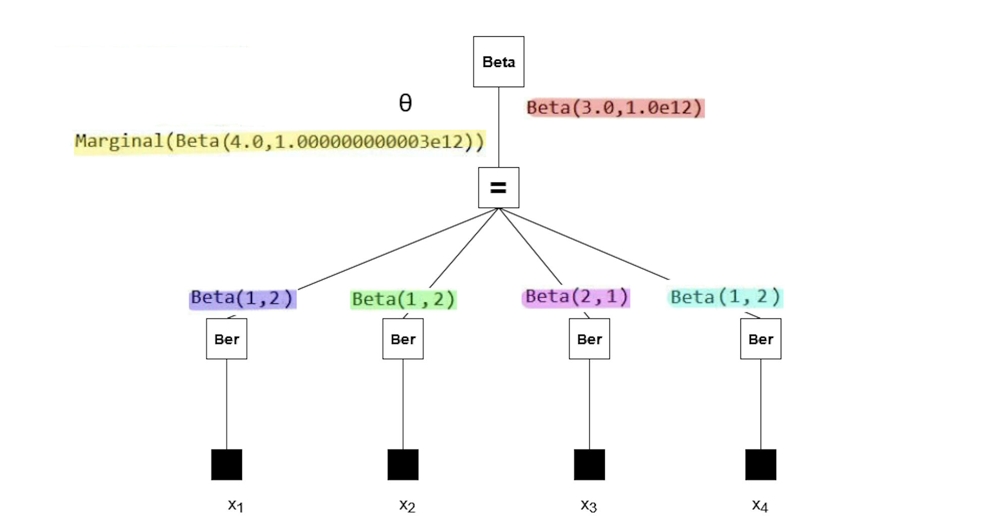

# [Debugging](@id user-guide-debugging)

Debugging inference in `RxInfer` can be challenging due to the reactive nature of the inference, undefined order of computations, the use of observables, and generally hard-to-read stack traces in Julia. This page covers several techniques to help you find and fix problems in your model.

!!! tip "Quick reference"
    - **Trace inference events** — use [`RxInferTraceCallbacks`](@ref) or `trace = true` to record every callback event. See [Trace callbacks](@ref manual-inference-trace-callbacks).
    - **Benchmark performance** — use [`RxInferBenchmarkCallbacks`](@ref) or `benchmark = true` to collect timing statistics. See [Benchmark callbacks](@ref manual-inference-benchmark-callbacks).
    - **Custom callbacks** — use the [Callbacks](@ref manual-inference-callbacks) system to inject arbitrary logic at any point during inference.

## Getting Help from the Community

When you encounter issues that are difficult to debug, the RxInfer community is here to help:

1. **Share Session Data**: For complex issues, you can share your session data to help us understand exactly what's happening in your model. See [Session Sharing](@ref manual-session-sharing) to learn how.

2. **Join Community Meetings**: We discuss common issues and solutions in our regular community meetings. See [Getting Help with Issues](@ref getting-help) for more information.

## [Using callbacks to inspect the inference procedure](@id user-guide-debugging-callbacks)

The [Callbacks](@ref manual-inference-callbacks) system lets you inject custom logic at specific moments during inference — for example, to print intermediate posteriors, track the order of updates, or collect diagnostics.

Below we show an application of callbacks to a model containing both scalar and vectorized latent variables.

```@example debugging-with-callbacks
using RxInfer

@model function vectorized_model(y)
    local u
    θ ~ Normal(mean= 1.0, var = 1.0)
    for i in 1:2
        u[i] ~ Normal(mean = θ, var = 1.0)
    end
    y .~ Normal(mean = u, var = 1.0)
end
```

Next, let us define a synthetic dataset:

```@example debugging-with-callbacks
dataset = [1.0, 2.0]
nothing #hide
```

Now we define callbacks that track the order of posterior updates and their intermediate values for each variational iteration.

!!! note "Note on Dispatch"
    Since `RxInfer` passes a collection of posteriors when updating vectorized variables, we branch on `posterior isa AbstractVector` to handle vectorized updates (e.g., `u`) using broadcasted operations like `mean.()`.

```@example debugging-with-callbacks
# A callback that will be called every time before a variational iteration starts
function before_iteration_callback(event)
    println("--- Starting iteration ", event.iteration, " ---")
end

# A callback that will be called every time after a variational iteration finishes
function after_iteration_callback(event)
    println("--- Iteration ", event.iteration, " has been finished ---")
end

# A callback that will be called every time a posterior is updated
function on_marginal_update_callback(event)
    variable_name = event.variable_name
    posterior = event.update
    if posterior isa AbstractVector
        println("Latent variable ", variable_name, " has been updated. Estimated mean is ", mean.(posterior), " with standard deviation ", std.(posterior))
    else
        println("Latent variable ", variable_name, " has been updated. Estimated mean is ", mean(posterior), " with standard deviation ", std(posterior))
    end
end
```

After defining the callbacks, pass them to [`infer`](@ref) as a named tuple:

```@example debugging-with-callbacks
result = infer(
    model = vectorized_model(),
    data  = (y = dataset, ),
    iterations = 3,
    initialization = @initialization(q(θ) = Uniform(0, 1)),
    returnvars = KeepLast(),
    callbacks = (
        on_marginal_update = on_marginal_update_callback,
        before_iteration   = before_iteration_callback,
        after_iteration    = after_iteration_callback
    )
)
nothing #hide
```

We can see that the callback has been correctly executed for each intermediate variational iteration, correctly handling both the scalar `θ` and the vector `u`.

```@example debugging-with-callbacks
println("Estimated mean u[1]: ", mean(result.posteriors[:u][1]))
println("Estimated mean u[2]: ", mean(result.posteriors[:u][2]))
println("Estimated mean θ: ", mean(result.posteriors[:θ]))
nothing #hide
```

## [Tracing callback events with `RxInferTraceCallbacks`](@id user-guide-debugging-trace-callbacks)

!!! tip
    For the full API reference, see the dedicated [Trace callbacks](@ref manual-inference-trace-callbacks) page.

For a quick overview of _which_ events fired and in what order, use [`RxInferTraceCallbacks`](@ref) (or simply pass `trace = true` to [`infer`](@ref)). This records every callback event — both RxInfer-level and ReactiveMP-level — as a [`TracedEvent`](@ref), making it easy to inspect the full inference lifecycle after the fact.

```@example debugging-with-callbacks
using RxInfer
using RxInfer.ReactiveMP: event_name

result = infer(
    model = vectorized_model(),
    data  = (y = dataset, ),
    iterations = 3,
    initialization = @initialization(q(θ) = Uniform(0, 1)),
    returnvars = KeepLast(),
    trace = true,
)

# Access the trace from model metadata
trace = result.model.metadata[:trace]

# Show all recorded event names
event_names = [event_name(e.event) for e in RxInfer.tracedevents(trace)]
println("Recorded ", length(event_names), " events")
println("Unique event types: ", unique(event_names))
```

You can also filter for specific events:

```@example debugging-with-callbacks
# How many iteration events were recorded?
before_iters = RxInfer.tracedevents(:before_iteration, trace)
println("Number of before_iteration events: ", length(before_iters))
```

## [Tracing individual message computations](@id user-guide-debugging-message-computations)

The `on_marginal_update` callback shown above reports posteriors as they become available. To trace finer-grained events — every individual rule invocation, message product, or marginal computation — use the lower-level message-passing callbacks such as `before_message_rule_call` and `after_message_rule_call`. See the [Callbacks](@ref manual-inference-callbacks) page for the full list of available events and their fields.

For a drop-in solution that records every event (iteration boundaries, rule calls, marginal updates, ...) into a structured log you can filter and inspect after inference, use [`RxInferTraceCallbacks`](@ref) or pass `trace = true` to [`infer`](@ref). See [Trace callbacks](@ref manual-inference-trace-callbacks) for details.

!!! note
    Earlier versions of RxInfer exposed a `LoggerPipelineStage` attached via the `where { pipeline = ... }` node clause. That API was removed together with `ReactiveMP`'s `AbstractPipelineStage` hierarchy in v6; the callback mechanism above subsumes its functionality without subscribing to the reactive streams.

## [Using `RxInferBenchmarkCallbacks` for performance analysis](@id user-guide-debugging-benchmark-callbacks)

!!! tip
    For the full API reference, model metadata integration, and programmatic access to statistics, see the dedicated [Benchmark callbacks](@ref manual-inference-benchmark-callbacks) page.

[`RxInferBenchmarkCallbacks`](@ref) collects timing information during the inference procedure. It aggregates timestamps across multiple runs, allowing you to track performance statistics (min/max/average/etc.) of your model's creation and inference procedure. You can either pass it directly as a `callbacks` argument, or simply use `benchmark = true` in the [`infer`](@ref) function.

```@example debugging-with-callbacks
using RxInfer

@model function iid_normal(y)
    μ  ~ Normal(mean = 0.0, variance = 100.0)
    γ  ~ Gamma(shape = 1.0, rate = 1.0)
    y .~ Normal(mean = μ, precision = γ)
end

init = @initialization begin
    q(μ) = vague(NormalMeanVariance)
end

infer(model = iid_normal(), data = (y = dataset, ), constraints = MeanField(), iterations = 5, initialization = init, callbacks = RxInferBenchmarkCallbacks()) #hide

# Create a benchmark callbacks instance to track performance
benchmark_callbacks = RxInferBenchmarkCallbacks()

# Run inference multiple times to gather statistics
for i in 1:3  # Usually you'd want more runs for better statistics
    infer(
        model = iid_normal(),
        data = (y = dataset, ),
        constraints = MeanField(),
        iterations = 5,
        initialization = init,
        callbacks = benchmark_callbacks
    )
end
```

To nicely display the statistics, install the `PrettyTables.jl` package.
It is not bundled with `RxInfer` by default, but if installed, it makes the output more readable.

```@example debugging-with-callbacks
using PrettyTables

# Display the benchmark statistics in a nicely formatted table
PrettyTables.pretty_table(benchmark_callbacks)
```

The [`RxInferBenchmarkCallbacks`](@ref) structure collects timestamps at various stages of the inference process:

- Before and after model creation
- Before and after inference starts/ends
- Before and after each iteration
- Before and after autostart (for streaming inference)

For the full API reference, programmatic access to statistics, and model metadata integration, see the dedicated [Benchmark callbacks](@ref manual-inference-benchmark-callbacks) page.

## [Legacy: Tracing message computations with `InputArgumentsAnnotations`](@id user-guide-debugging-memory-addon)

!!! warning "Legacy feature"
    The `InputArgumentsAnnotations` system is a legacy feature from `ReactiveMP` and may be removed in a future release.
    For most debugging and inspection use cases, the [Trace callbacks](@ref manual-inference-trace-callbacks) system is more powerful and easier to use — it records every event (including message rule calls, product computations, form constraint applications, and marginal computations) from both RxInfer and ReactiveMP.

`RxInfer` provides a way to save the history of the computations leading up to the computed messages and marginals. This history is added on top of messages and marginals and is referred to as an _Input Arguments Annotation_.

!!! note
    Annotations are a feature of `ReactiveMP`. Read more about implementing custom annotations in the corresponding section of the `ReactiveMP` package.

We demonstrate the Input Arguments Annotation on the coin toss example from [earlier](@ref user-guide-getting-started-coin-flip-simulation) in the documentation. We model the binary outcome $x$ (heads or tails) using a `Bernoulli` distribution, with a parameter $\theta$ that represents the probability of landing on heads. We have a `Beta` prior distribution for the $\theta$ parameter, with a known shape $\alpha$ and rate $\beta$ parameter.

$$\theta \sim \mathrm{Beta}(a, b)$$
$$x_i \sim \mathrm{Bernoulli}(\theta)$$

where $x_i \in {0, 1}$ are the binary observations (heads = 1, tails = 0). This is the corresponding RxInfer model:

```@example addoncoin
using RxInfer, Random, Plots

n = 4
θ_real = 0.3
dataset = float.(rand(Bernoulli(θ_real), n))

@model function coin_model(x)
    θ  ~ Beta(4, huge)
    x .~ Bernoulli(θ)
end

result = infer(
    model = coin_model(),
    data  = (x = dataset, ),
)
```

The model runs without errors. But when we plot the posterior distribution for $\theta$, something's wrong — the posterior seems to be a flat distribution:

```@example addoncoin

rθ = range(0, 1, length = 1000)

plot(rθ, (rvar) -> pdf(result.posteriors[:θ], rvar), label="Infered posterior")
vline!([θ_real], label="Real θ", title = "Inference results")
```

We can figure out what's wrong by tracing the computation of the posterior with the Input Arguments Annotation.
To obtain the trace, add `annotations = (InputArgumentsAnnotations(),)` as an argument to the [`infer`](@ref) function.
Note that the argument to the `annotations` keyword argument must be a tuple, because multiple annotations can be activated at the same time.

```@example addoncoin
result = infer(
    model = coin_model(),
    data  = (x = dataset, ),
    annotations = (InputArgumentsAnnotations(),)
)
```
Now we have access to the messages that led to the marginal posterior:

```@example addoncoin
RxInfer.ReactiveMP.getannotations(result.posteriors[:θ])
```



The messages in the factor graph are marked in color. If you're interested in the mathematics behind these results, consider verifying them manually using the general equation for sum-product messages:

$$\underbrace{\overrightarrow{\mu}_{θ}(θ)}_{\substack{ \text{outgoing}\\ \text{message}}} = \sum_{x_1,\ldots,x_n} \underbrace{\overrightarrow{\mu}_{X_1}(x_1)\cdots \overrightarrow{\mu}_{X_n}(x_n)}_{\substack{\text{incoming} \\ \text{messages}}} \cdot \underbrace{f(θ,x_1,\ldots,x_n)}_{\substack{\text{node}\\ \text{function}}}$$



Note that the posterior (yellow) has a rate parameter on the order of `1e12`. Our plot failed because a Beta distribution with such a rate parameter cannot be accurately depicted using the range of $\theta$ we used in the code block above. So why does the posterior have this rate parameter?

All the observations (purple, green, pink, blue) have much smaller rate parameters. It seems the prior distribution (red) has an unusual rate parameter, namely `1e12`. If we look back at the model, the parameter was set to `huge` (which is a reserved keyword meaning `1e12`). Reducing the prior rate parameter will ensure the posterior has a reasonable rate parameter as well.


```@example addoncoin
@model function coin_model(x)
    θ  ~ Beta(4, 100)
    x .~ Bernoulli(θ)
end

result = infer(
    model = coin_model(),
    data  = (x = dataset, ),
)
```

```@example addoncoin
rθ = range(0, 1, length = 1000)

plot(rθ, (rvar) -> pdf(result.posteriors[:θ], rvar), fillalpha = 0.4, fill = 0, label="Infered posterior")
vline!([θ_real], label="Real θ", title = "Inference results")
```

Now the posterior has a much more sensible shape, confirming that we have identified the original issue correctly.
We can run the model with more observations to get an even better posterior:

```@example addoncoin
result = infer(
    model = coin_model(),
    data  = (x = float.(rand(Bernoulli(θ_real), 1000)), ),
)

rθ = range(0, 1, length = 1000)
plot(rθ, (rvar) -> pdf(result.posteriors[:θ], rvar), fillalpha = 0.4, fill = 0, label="Infered posterior (1000 observations)")
vline!([θ_real], label="Real θ", title = "Inference results")
```
