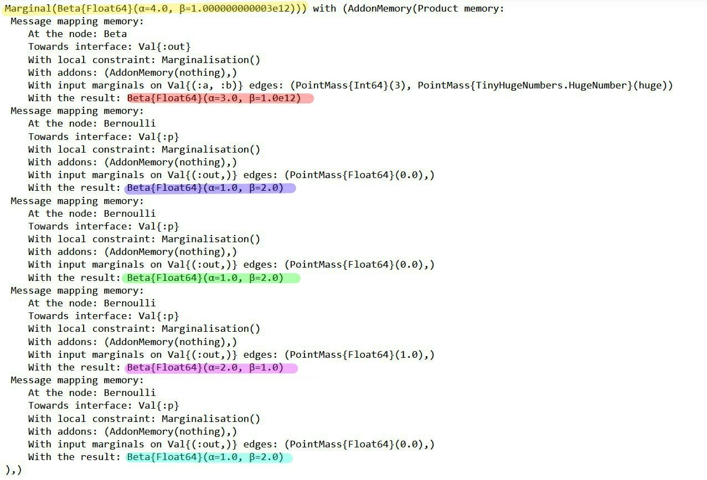

# [Debugging](@id user-guide-debugging)

Addon is a memory that shows the full computation history of the messages and marginals. This memory can be used for debugging purposes. Two examples are as follows:

The first example is a homework of a student in a Bayesian machine learning class. He tried to make a probabilistic model for a coin toss problem. This is his description of the problem:

In this coin toss example, I assumed four random inputs according to an unfair coin. As the coin has only two incomes, I used a Bernoulli distribution as my likelihood. 
The goal of this example is to infer 𝜃 which is the parameter for this distribution. I also set a Beta distribution for the 𝜃 parameter and considered the 𝑎 and 𝑏, the parameters for the Beta distributions with some prior knowledge of the coin behavior.


So my model can be represented as:

```math 
y_i \sim \mathrm{Bernoulli}(\theta),
```
```math 
\theta \sim Beta(a, b),
```

where ``y_i \in {0, 1}`` are the binary observations. And this is my RxInfer model:

```@example addoncoin
using RxInfer, Random, Plots

n = 4
θ_real = 0.3
dataset = float.(rand(Bernoulli(θ_real), n));

@model function coin_model(n)
    
    # Input data
    y = datavar(Float64, n)
    
    # θ prior
    θ ~ Beta(4, huge)

    # Likelihood for each input
    for i in 1:n
        y[i] ~ Bernoulli(θ)
    end

end

result = inference(
    model = coin_model(length(dataset)), 
    data  = (y = dataset, ),
);

```
But when I get and plot the marginal distribution for 𝜃, It seems the model is unable to learn from the data. 

```@example addoncoin

θestimated = result.posteriors[:θ]
rθ = range(0, 1, length = 1000)

plot(rθ, (x) -> pdf(θestimated, x),title = "Inference results", label="Infered posterior")
vline!([θ_real], label="Real θ")
```
This is how we debugged the code using the Addons memory. First, we simply added the 𝑎𝑑𝑑𝑜𝑛𝑠=(𝐴𝑑𝑑𝑜𝑛𝑀𝑒𝑚𝑜𝑟𝑦(),) argument to the inference function.

```@example addoncoin
result = inference(
    model = coin_model(length(dataset)), 
    data  = (y = dataset, ),
    addons = (AddonMemory(),)
)
```
Now we have access to the massages when we get the result posterior. With running result.posteriors[:θ]



We mapped the messages in the factor graph to be more convenient to follow. Also to dive deeper into the computation of the messages you can consider the following manual results with the general equation for the sum-product message:

```math 
\underbrace{\overrightarrow{\mu}_{Y}(y)}_{\substack{ \text{outgoing}\\ \text{message}}} = \sum_{x_1,\ldots,x_n} \underbrace{\overrightarrow{\mu}_{X_1}(x_1)\cdots \overrightarrow{\mu}_{X_n}(x_n)}_{\substack{\text{incoming} \\ \text{messages}}} \cdot \underbrace{f(y,x_1,\ldots,x_n)}_{\substack{\text{node}\\ \text{function}}} 
```


Now it can easily be seen that the initial amount for the prior distribution is the cause of the unreasonable posterior. It seems the student mistakenly thinks the second parameter of Beta distribution is a variance and he put a huge number to set a wide range for it. We suggest he change the second parameter or use a Uniform distribution instate of that.


```@example addoncoin
@model function coin_model(n)
    
    # Input data
    y = datavar(Float64, n)
    
    # θ prior
    θ ~ Beta(4, 4)

    # Likelihood for each input
    for i in 1:n
        y[i] ~ Bernoulli(θ)
    end

end

result = inference(
    model = coin_model(length(dataset)), 
    data  = (y = dataset, ),
);
```

```@example addoncoin
θestimated = result.posteriors[:θ]
rθ = range(0, 1, length = 1000)

plot(rθ, (x) -> pdf(θestimated, x),title = "Inference results", label="Infered posterior")
vline!([θ_real], label="Real θ")
```

A more accurate result can be given with more data.