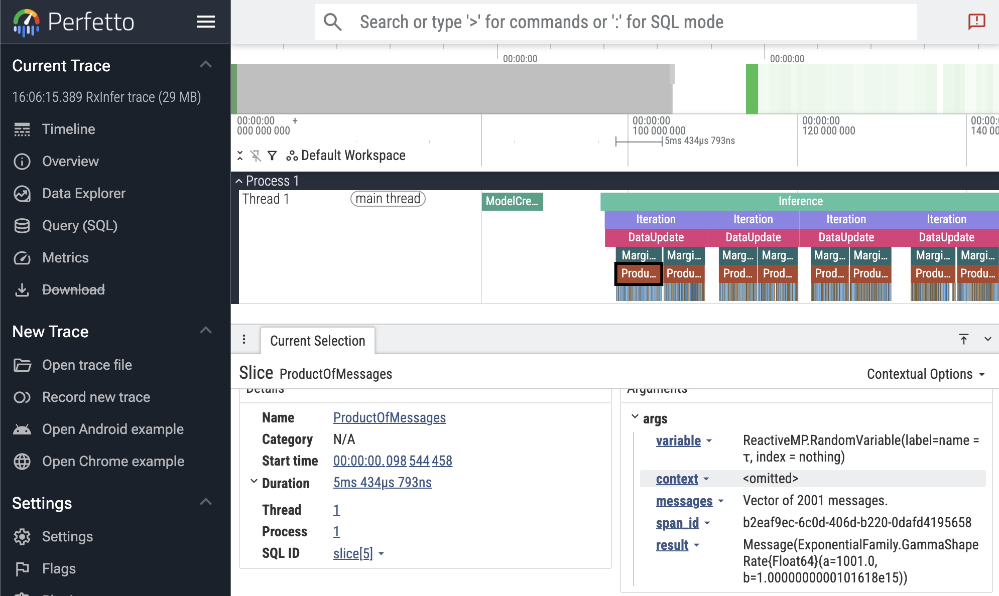

# [Trace callbacks](@id manual-inference-trace-callbacks)

```@meta
CurrentModule = RxInfer
```

`RxInfer` provides a built-in callback structure called [`RxInferTraceCallbacks`](@ref) for recording all callback events during the inference procedure.
Each event is stored as a [`TracedEvent`](@ref) containing the event name (as a `Symbol`) and the event object itself.
This is useful for debugging, understanding the inference flow, and inspecting what happens at each stage.
For general information about the callbacks system, see [Callbacks](@ref manual-inference-callbacks).

## Basic usage

```@example manual-inference-trace-callbacks
using RxInfer
using Test #hide

@model function iid_normal(y)
    μ  ~ Normal(mean = 0.0, variance = 100.0)
    γ  ~ Gamma(shape = 1.0, rate = 1.0)
    y .~ Normal(mean = μ, precision = γ)
end

init = @initialization begin
    q(μ) = vague(NormalMeanVariance)
end

# Create a trace callbacks instance
trace = RxInferTraceCallbacks()

result = infer(
    model = iid_normal(),
    data = (y = randn(10),),
    constraints = MeanField(),
    iterations = 3,
    initialization = init,
    callbacks = trace,
)

events = RxInfer.tracedevents(trace)
@test !isempty(events) #hide
@test all(e -> e isa TracedEvent, events) #hide

println("Recorded $(length(events)) events")
for i in 1:10
    println("  ", events[i])
end
println("...")
```

## Using `trace = true`

Instead of creating a `RxInferTraceCallbacks` instance manually, you can use the `trace = true` keyword argument in the [`infer`](@ref) function.
This automatically merges a `RxInferTraceCallbacks` instance with any user-provided callbacks and saves it to the model's metadata:

```@example manual-inference-trace-callbacks
result = infer(
    model = iid_normal(),
    data = (y = randn(10),),
    constraints = MeanField(),
    iterations = 3,
    initialization = init,
    trace = true,
)

@test haskey(result.model.metadata, :trace) #hide
@test result.model.metadata[:trace] isa RxInferTraceCallbacks #hide

trace = result.model.metadata[:trace]
events = RxInfer.tracedevents(trace)
println("Recorded $(length(events)) events via trace = true")
```

## Accessing from model metadata

After model creation, the trace callbacks instance is automatically saved into the model's metadata under the `:trace` key.
This makes it accessible from the inference result without needing to hold onto the callbacks object separately:

```@example manual-inference-trace-callbacks
result = infer(
    model = iid_normal(),
    data = (y = randn(10),),
    constraints = MeanField(),
    iterations = 3,
    initialization = init,
    callbacks = RxInferTraceCallbacks(),
)

@test haskey(result.model.metadata, :trace) #hide
@test result.model.metadata[:trace] isa RxInferTraceCallbacks #hide

trace = result.model.metadata[:trace]
events = RxInfer.tracedevents(trace)
println("Recorded $(length(events)) events via trace = true")
```

## Inspecting traced events

Each [`TracedEvent`](@ref) has a single field:
- `event::ReactiveMP.Event` — the original event object that was passed to the callback

You can retrieve the event name via `ReactiveMP.event_name(typeof(traced_event.event))` and access event-specific fields directly on `traced_event.event`.

```@example manual-inference-trace-callbacks
using RxInfer.ReactiveMP: event_name
events = RxInfer.tracedevents(trace)

# Filter for specific events
iteration_events = filter(e -> event_name(typeof(e.event)) === :before_iteration, events)
@test length(iteration_events) == 3 #hide
println("Number of iterations: ", length(iteration_events))
```

## Combining with other callbacks

`trace = true` is compatible with other callbacks, including `benchmark = true` and custom callbacks:

```@example manual-inference-trace-callbacks
result = infer(
    model = iid_normal(),
    data = (y = randn(10),),
    constraints = MeanField(),
    iterations = 3,
    initialization = init,
    trace = true,
    benchmark = true,
)

@test haskey(result.model.metadata, :trace) #hide
@test haskey(result.model.metadata, :benchmark) #hide

println("Trace included: ", haskey(result.model.metadata, :trace))
println("Benchmark included: ", haskey(result.model.metadata, :benchmark))
```

## Viewing traces in Perfetto

A recorded trace can be inspected interactively with the [Perfetto](https://perfetto.dev/) trace viewer.
Use [`perfetto_view`](@ref) to embed the viewer inside a Pluto, VS Code or Jupyter notebook cell, or [`perfetto_open`](@ref) to open it in your default browser.

Inside Perfetto, you can navigate (zoom and pan) using the `WASD` keys. You can select with the mouse, and inspect individual events. **Press `?` for a quick help menu.**

```julia
result = infer(model = iid_normal(), data = (y = randn(10),), iterations = 3, trace = true)
traces = RxInfer.tracedevents(result.model.metadata[:trace])

perfetto_view(traces)   # show directly in your IDE (Pluto, VS Code, Jupyter)
perfetto_open(traces)   # open in the browser
```



In the screenshot above, the first `ProductOfMessages` event is selected, showing the event details in the bottom panel. Here you see the duration (5ms), and the event arguments, including the `result` distribution.

If you are interested in debugging the performance of your inference call, take note that runtimes can vary greatly between runs due to Julia features like GC and JIT compilation. Try running your inference multiple times to get a better picture. You can also try to use Julia's built-in profiler.

!!! hint "Experimental feature"
    The Perfetto functionality is still experimental, and we would value your feedback! Let us know if you encounter any issues or have suggestions for improvement.
    
```@docs 
perfetto_view
perfetto_open
RxInfer.PerfettoDisplay
```

## Exporting to TensorBoard

When [`TensorBoardLogger.jl`](https://github.com/PhilipVinc/TensorBoardLogger.jl) is loaded, the `TensorBoardLoggerExt` extension activates and provides `RxInfer.convert_to_tensorboard`, which converts a recorded trace into TensorFlow event files readable by TensorBoard.

```julia
using RxInfer
using TensorBoardLogger  # activates the extension

result = infer(
    model = iid_normal(),
    data = (y = randn(10),),
    constraints = MeanField(),
    iterations = 5,
    initialization = init,
    trace = true,
)

trace = result.model.metadata[:trace]

log_dir = RxInfer.convert_to_tensorboard(trace; log_distributions = true)
# Then run: tensorboard --logdir="<log_dir>"
```

### What gets logged

| Output | TensorBoard tab | Condition |
|--------|----------------|-----------|
| Per-iteration wall-clock duration (`iteration_time_ms`) | Scalars | always |
| Parameterisation-aware scalar tags for each posterior (see table below) | Scalars | `log_posteriors` admits the variable (see [Filtering posteriors](@ref tensorboard-log-posteriors)) |
| Per-iteration histogram of posterior samples (`posteriors/<var>/distribution`) | Distributions / Histograms | `log_distributions = true` **and** `log_posteriors` admits the variable |
| `EventCounts` per-event-type table | Text | always |
| `Summary` run-timing rollup (see [Run summary](@ref tensorboard-run-summary)) | Text | always |
| Per-event narrative breadcrumbs (`Events`, `before_iteration`, …) | Text | `log_text_events = true` |

#### Posterior scalar tags by family

Each posterior is logged under `posteriors/<variable>/<tag>` with one step per inference iteration. Specific dispatch is selected by the marginal's distribution type — the most-specific method wins, with the generic `mean`/`var` fallback catching anything not listed.

| Distribution family | Emitted tags |
|---|---|
| `Normal` (any of the `UnivariateNormalDistributionsFamily` aliases) | `mean`, `precision` |
| `Gamma` (any of the `GammaDistributionsFamily` aliases) | `shape`, `rate` |
| `Beta` | `alpha`, `beta`, `mean` |
| `Bernoulli` | `succprob` |
| `Binomial` | `ntrials`, `succprob` |
| `InverseGamma` (a.k.a. `GammaInverse`) | `shape`, `scale` |
| `Poisson` | `rate` |
| `Geometric` | `succprob` |
| `NegativeBinomial` | `r`, `succprob` |
| `Exponential` | `rate` |
| `VonMises` | `location`, `concentration` |
| `Weibull` | `shape`, `scale` |
| `LogNormal` | `meanlog`, `stdlog` |
| `Erlang` | `shape`, `scale` |
| `Laplace` | `location`, `scale` |
| `Pareto` | `shape`, `scale` |
| `Rayleigh` | `scale` |
| `Chisq` | `dof` |
| any other `UnivariateDistribution` (fallback) | `mean`, `var` |

Marginals that are not univariate (e.g. multivariate Normal, matrix-variate posteriors) are silently skipped on the scalar path and produce no `posteriors/...` scalar tags. The histogram path is also gated on `<: UnivariateDistribution`, so the same families above are the ones that contribute to the Distributions / Histograms tabs when `log_distributions = true`.

### [Run summary](@id tensorboard-run-summary)

The `Summary` text tag is a one-shot snapshot of the run, written at step `1` alongside `EventCounts`. Each row is a `key: value` line; rows whose underlying measurement is missing (no matching `Before*`/`After*` event seen, or no iteration durations recorded) are silently skipped, so partial runs still produce a useful table instead of zero-valued placeholders.

| Row | Meaning | Source |
|---|---|---|
| `model_build` | Wall-clock between `BeforeModelCreationEvent` and `AfterModelCreationEvent`. | Paired event timestamps. |
| `inference` | Wall-clock between `BeforeInferenceEvent` and `AfterInferenceEvent`. | Paired event timestamps. |
| `total_wall` | First-to-last traced event timestamp — covers the whole `infer` call, including any time before model creation or after inference. | First and last `TracedEvent.time_ns`. |
| `n_iterations` | Number of paired iteration spans observed. | Length of the per-iteration duration map. |
| `iter_total`, `iter_mean`, `iter_min`, `iter_max` | Aggregates over per-iteration wall-clock durations (sum, mean, min, max). | Same per-iteration durations that drive the `iteration_time_ms` scalar. |

`Summary` complements rather than replaces existing outputs: per-iteration durations remain in the `iteration_time_ms` scalar series, and the per-event-type breakdown stays in `EventCounts`. The Summary tag is always emitted for any trace that contains at least one event — it is not gated by `log_text_events`, `log_posteriors`, or `log_distributions`.

### [Filtering posteriors](@id tensorboard-log-posteriors)

The `log_posteriors` keyword controls **which** marginals reach the `posteriors/<var>/*` tags. It is independent of `log_distributions`, which controls **what** is emitted (scalars only vs. scalars + per-iteration histogram). Think of `log_posteriors` as the row filter and `log_distributions` as the column filter.

| `log_posteriors` value | Effect |
|---|---|
| `true` *(default)* | Log every marginal the model produces. |
| `false` | Suppress every `posteriors/*` tag (both scalars and histograms). Iteration timing, event counts, and event-text breadcrumbs are unaffected. |
| `Vector{String}` or `Vector{Symbol}` | Log only marginals whose name appears in the list. Both `["μ", "θ"]` and `[:μ, :θ]` are accepted. An empty list behaves like `false`. |

```julia
trace = result.model.metadata[:trace]

# Log only μ (the τ posterior is skipped on both scalar and histogram paths).
RxInfer.convert_to_tensorboard(
    trace;
    log_posteriors    = ["μ"],
    log_distributions = true,
)

# Suppress every posterior tag while keeping iteration timing visible.
RxInfer.convert_to_tensorboard(trace; log_posteriors = false)
```

When `log_posteriors` is an allow-list, the per-event text breadcrumb under `on_marginal_update/<var>` (gated by `log_text_events`) still fires for every variable — so you can keep visibility on which marginals updated without paying the scalar/histogram cost.

```@docs 
RxInfer.convert_to_tensorboard
```

## API Reference

```@docs
RxInferTraceCallbacks
TracedEvent
RxInfer.tracedevents
RxInfer.is_trace_event_included
```
