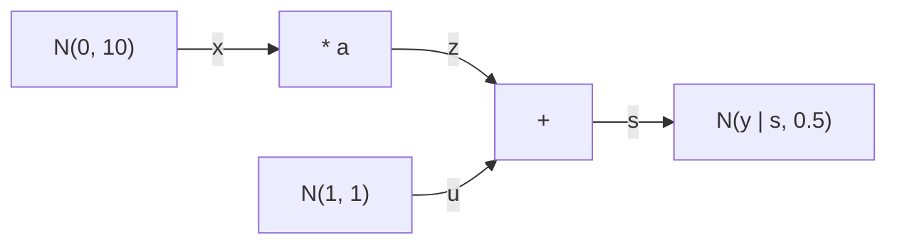

# [Messages by hand](@id learning-messages-by-hand)

This page runs belief propagation on a small model by hand. You compute every message with the
rules RxInfer runs, multiply the messages at a variable to get its posterior, and check the
posterior against the closed form. Then [`infer`](@ref) runs the same model and returns the same
posteriors.

A [message](@extref MessagePassingRulesBase glossary-message) is a function of one variable,
sent along an edge of a [factor graph](@ref concepts-factor-graphs). A
[rule](@extref MessagePassingRulesBase glossary-rule) computes one message of one
[factor node](@extref MessagePassingRulesBase glossary-factor-node) from the messages on the
node's other edges. [Message passing](@ref concepts-message-passing) introduces the algorithm;
this page computes it step by step.

```@example messages-by-hand
using RxInfer, BayesBase
nothing # hide
```

## A message is an integral

A factor node ``f(x, y_1, \dots, y_n)`` sends a message towards ``x`` that integrates the node
function against the messages on its other edges:

```math
\mu_{f \to x}(x) = \int f(x, y_1, \dots, y_n) \prod_{i=1}^{n} \mu_{y_i \to f}(y_i) \, \mathrm{d}y_1 \cdots \mathrm{d}y_n .
```

This is the sum-product rule of
[belief propagation](@extref MessagePassingRulesBase glossary-belief-propagation). The posterior
of a variable is the normalized product of the messages that arrive at it. In a chain, every
variable sits between two nodes, so its posterior is the product of a forward and a backward
message.

## The addition node

The node `+` relates three variables, ``\mathrm{out} = \mathrm{in}_1 + \mathrm{in}_2``. Its node
function is a Dirac delta, ``f(\mathrm{out}, \mathrm{in}_1, \mathrm{in}_2) = \delta(\mathrm{out} - \mathrm{in}_1 - \mathrm{in}_2)``,
and the function `+` itself is the node:

```@example messages-by-hand
MessagePassingRulesBase.nodespec(+)
```

The [interfaces](@extref MessagePassingRulesBase glossary-interface) are the node's edges:
`out`, `in1` and `in2`. A model creates this node when it writes `s := z + u`.

The message towards `out` integrates the delta out, which leaves a convolution of the two input
messages:

```math
\mu(\mathrm{out}) = \int \mu_{\mathrm{in}_1}(\mathrm{in}_1)\, \mu_{\mathrm{in}_2}(\mathrm{out} - \mathrm{in}_1) \, \mathrm{d}\mathrm{in}_1 .
```

For two normal messages ``\mathcal{N}(m_1, v_1)`` and ``\mathcal{N}(m_2, v_2)``, the convolution
is ``\mathcal{N}(m_1 + m_2, v_1 + v_2)``.
[`@call_message_update_rule`](@extref MessagePassingRulesBase.@call_message_update_rule) finds the
rule for a node, a target and the inputs you give, and runs it:

```@example messages-by-hand
@call_message_update_rule(
    node = +, target = :out,
    m = (in1 = NormalMeanVariance(1.0, 1.0), in2 = NormalMeanVariance(2.0, 1.0)),
)
```

The result draws the node. The input messages are solid arrows into the node, and the target is
the double arrow out of it. The message is ``\mathcal{N}(3, 2)``: the means add and the
variances add. The value is a [`RuleResult`](@extref MessagePassingRulesBase.RuleResult), and
[`getresult`](@extref MessagePassingRulesBase.getresult) returns the message itself.

The message towards an input runs the sum backwards. Towards `in2`, the delta sets
``\mathrm{in}_2 = \mathrm{out} - \mathrm{in}_1``, and the message is
``\mathcal{N}(m_{\mathrm{out}} - m_1, v_{\mathrm{out}} + v_1)``:

```@example messages-by-hand
@call_message_update_rule(
    node = +, target = :in2,
    m = (out = NormalMeanVariance(5.0, 1.0), in1 = NormalMeanVariance(1.0, 1.0)),
)
```

## The multiplication node with a known gain

The node `*` relates ``\mathrm{out} = A \cdot \mathrm{in}``. When the gain ``A = a`` is known,
its message is a [point mass](@extref MessagePassingRulesBase glossary-point-mass),
`PointMass(a)`, a distribution with all its mass at ``a``. The message towards `out` scales the
input: a normal ``\mathcal{N}(m, v)`` becomes ``\mathcal{N}(a m, a^2 v)``.

```@example messages-by-hand
@call_message_update_rule(
    node = *, target = :out,
    m = (A = PointMass(2.0), in = NormalMeanVariance(1.0, 1.0)),
)
```

Towards `in`, the delta evaluates the message on `out` at ``a \cdot \mathrm{in}``:

```math
\mu(\mathrm{in}) = \int \delta(\mathrm{out} - a \cdot \mathrm{in})\, \mu_{\mathrm{out}}(\mathrm{out}) \, \mathrm{d}\mathrm{out}
                 = \mathcal{N}(a \cdot \mathrm{in} \mid m, v) .
```

As a function of ``\mathrm{in}``, this is a normal with precision ``w = a^2 / v`` and weighted
mean ``\xi = a m / v``, the precision times the mean. It integrates to ``1 / |a|``, not to one.

```@example messages-by-hand
@call_message_update_rule(
    node = *, target = :in,
    m = (out = NormalMeanVariance(1.0, 1.0), A = PointMass(2.0)),
)
```

The message is ``\mathcal{N}(0.5, 0.25)`` in weighted-mean form. Its
[log scale](@extref MessagePassingRulesBase glossary-log-scale), ``-\log 2``, is the logarithm
of the constant ``1/|a|`` that the message carries beyond a normalized distribution. The last
section adds such constants up to the model's evidence. The card also lists `matrix_correction`,
a [service](@extref MessagePassingRulesBase glossary-service) that the rule reads to keep a
precision matrix invertible; its default serves here.

## A model: one step of a tracking filter

A hidden position ``x`` moves to ``s = a x + u``, where ``u`` is a noisy control input, and a
sensor observes ``s`` with noise:

```math
\begin{aligned}
x &\sim \mathcal{N}(0, 10), & u &\sim \mathcal{N}(1, 1), \\
s &= a x + u, & y &\sim \mathcal{N}(s, 0.5),
\end{aligned}
```

with the gain ``a = 2`` and the observation ``y = 3``. Name the product ``z = a x``. The factor
graph is a chain of five nodes:



Belief propagation sends messages forwards from the priors to ``s``, and backwards from the
observation to ``x``.

### Forward messages

A prior node with known parameters sends its own distribution towards `out`:

```@example messages-by-hand
a, y = 2.0, 3.0

prior_x = @call_message_update_rule(
    node = NormalMeanVariance, target = :out,
    m = (μ = PointMass(0.0), v = PointMass(10.0)),
)
```

The message on ``x`` then passes through `*`, and meets the message on ``u`` at `+`:

```@example messages-by-hand
m_x = getresult(prior_x)
m_z = getresult(@call_message_update_rule(node = *, target = :out, m = (A = PointMass(a), in = m_x)))
m_u = getresult(@call_message_update_rule(node = NormalMeanVariance, target = :out, m = (μ = PointMass(1.0), v = PointMass(1.0))))
m_s = getresult(@call_message_update_rule(node = +, target = :out, m = (in1 = m_z, in2 = m_u)))
```

The forward message on ``s`` is the prediction of ``s`` before the observation:
``\mathcal{N}(2 \cdot 0 + 1,\; 4 \cdot 10 + 1)``.

### Backward messages

The observation enters as a point mass on the likelihood's `out`. The message towards `μ`, the
mean, is the likelihood of the observation as a function of ``s``:

```@example messages-by-hand
likelihood_s = @call_message_update_rule(
    node = NormalMeanVariance, target = :μ,
    m = (out = PointMass(y), v = PointMass(0.5)),
)
```

The backward message then crosses `+` towards `in1`, which is ``z``, and `*` towards `in`,
which is ``x``:

```@example messages-by-hand
b_s = getresult(likelihood_s)
b_z = getresult(@call_message_update_rule(node = +, target = :in1, m = (out = b_s, in2 = m_u)))
b_x = getresult(@call_message_update_rule(node = *, target = :in, m = (out = b_z, A = PointMass(a))))
```

### Posteriors

The posterior of ``x`` is the product of its forward and backward messages. BayesBase's
`prod(ClosedProd(), left, right)` multiplies two densities in closed form, and returns a
normalized distribution:

```@example messages-by-hand
q_x = prod(ClosedProd(), m_x, b_x)
q_s = prod(ClosedProd(), m_s, b_s)
mean_var(q_x)
```

The closed form agrees. Given ``x``, the observation is ``y \sim \mathcal{N}(a x + 1, 1.5)``,
since the variances of ``u`` and of the sensor noise add. The posterior precision of ``x`` is the
prior's plus ``a^2 / 1.5``, and its mean is ``a (y - 1) / 1.5`` divided by that precision:

```@example messages-by-hand
w = 1 / 10 + a^2 / 1.5
(mean = a * (y - 1) / 1.5 / w, var = 1 / w)
```

## The same model in RxInfer

The model below is the same chain. `:=` defines a
[deterministic relationship](@ref user-guide-model-specification-node-creation-deterministic),
so `z` and `s` are the outputs of `*` and `+`:

```@example messages-by-hand
@model function tracking_step(y, a)
    x ~ NormalMeanVariance(0.0, 10.0)
    u ~ NormalMeanVariance(1.0, 1.0)
    z := a * x
    s := z + u
    y ~ NormalMeanVariance(s, 0.5)
end

result = infer(model = tracking_step(a = a), data = (y = y,), free_energy = true)
```

`infer` runs the rules you ran, in the order their inputs arrive, and multiplies the messages at
each variable:

```@example messages-by-hand
(
    x = (by_hand = mean_var(q_x), rxinfer = mean_var(result.posteriors[:x])),
    s = (by_hand = mean_var(q_s), rxinfer = mean_var(result.posteriors[:s])),
)
```

RxInfer gives the rules of a stochastic node its observations and constants as point-mass
[marginals](@extref MessagePassingRulesBase glossary-marginal), `q = (…)`, rather than as
messages. For a point mass the two are the same distribution, and the rules return the same
message.

## The evidence

The model's evidence is the probability of the observation, ``p(y) = \mathcal{N}(y \mid 1, a^2 \cdot 10 + 1 + 0.5)``.
On a graph without loops, belief propagation is exact, and the
[Bethe free energy](@ref lib-bethe-free-energy) that `free_energy = true` computes equals
``-\log p(y)``:

```@example messages-by-hand
(free_energy = result.free_energy[end], minus_log_evidence = -logpdf(NormalMeanVariance(1.0, a^2 * 10 + 1.5), y))
```

The log scales of the messages add up to the same number. With `logscales = true`, every
message and posterior carries its log scale, and the log scale of a posterior is ``\log p(y)``:

```@example messages-by-hand
with_logscales = infer(model = tracking_step(a = a), data = (y = y,), logscales = true)
getlogscale(with_logscales.posteriors[:x])
```

## Next steps

- [Variational message passing by hand](@ref learning-vmp-by-hand) runs a model where belief
  propagation has no closed form, and minimizes the free energy with a factorized posterior.
- [Understanding rules](@ref what-is-a-rule) explains how RxInfer finds the rule for each
  message.
- [Creating your own custom nodes](@ref create-node) writes a node and its rules.
