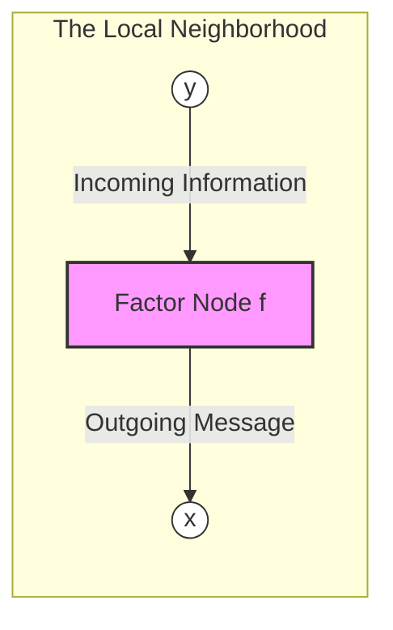

# [Understanding Rules: The Mechanics of Message Passing](@id what-is-a-rule)

In RxInfer, a Rule is a computational unit that defines how information flows across a specific edge of your factor graph.

Users often ask: "Why do some rules take `m_x` as input, while others take `q_x`? And what about `q_xy`?"

The answer lies in the variational constraints you place on your model. Depending on whether you are running unconstrained Belief Propagation or Mean-Field Variational Inference, the nodes in your graph need to perform different mathematical operations, which requires different types of input data.

## Visualizing a Rule

Consider a simple factor node $f$ connecting an input variable $y$ to an output variable $x$. When the node needs to send a message to $x$, the Rule defines how to transform the incoming information from $y$ into that outgoing message.

The "Rule" is the logic inside the pink box. It answers the question: "Given what I know about $y$, what should I tell $x$?"

## The Analogy: Telephone vs. Surveys

To understand which rule RxInfer needs, imagine the nodes in your graph are agents trying to learn about the world. They use different "protocols" to communicate based on the constraints you apply.

### 1. The "Telephone" Protocol (Belief Propagation)

**Context**: No constraints are applied (or the graph is a tree).

- **Input Prefix**: `m_` (Incoming Message)
- **The Logic**: "I don't know the final truth, but I will pass on the specific message I just received from my neighbor."
- **The Math (Sum-Product Integral)**: In exact inference, a factor node $f(x, y)$ calculates a message towards $x$ by integrating the factor with the incoming message from $y$ ($\vec{\mu}(y)$):

$$\vec{\mu}(x) \propto \int f(x, y) \cdot \vec{\mu}(y) \, dy$$

- **Why `m_`?** To solve this integral, the node only needs the "incoming opinion" ($\vec{\mu}(y)$) from the neighbor branch. It does not need the neighbor's final marginal belief.

### 2. The "Survey" Protocol (Variational Message Passing)

**Context**: Factorization constraints are applied (e.g., Mean-Field $q(x,y) = q(x)q(y)$).

- **Input Prefix**: `q_` (Marginal Distribution)
- **The Logic**: "To minimize the global error (Free Energy), I need to calculate the average opinion (expectation) of my neighbors."
- **The Math (Variational Expectation)**: In Variational Message Passing (VMP), the update minimizes the KL-divergence. This results in an update equation based on the expectation of the log-factor:

$$\ln \vec{\mu}(x) \propto \mathbb{E}_{q(y)} \left[ \ln f(x, y) \right]$$

- **Why `q_`?** To calculate an expectation $\mathbb{E}_{q(y)}$, the node must know the marginal distribution $q(y)$ of the neighbor. A simple message is not enough; it needs the full summary of the neighbor's belief.

### 3. The "Team Report" Protocol (Structured Inference)

**Context**: Structured constraints (variables are coupled in blocks).

- **Input Prefix**: `q_ab` (Joint Marginal)
- **The Logic**: "Variables A and B are strictly coupled. I cannot look at them separately; I need a joint report on how they relate to each other."
- **The Math**: Similar to VMP, but the expectation is taken over the joint distribution of the coupled variables:

$$\ln \vec{\mu}(x) \propto \mathbb{E}_{q(y, z)} \left[ \ln f(x, y, z) \right]$$

- **Why `q_yz`?** If $y$ and $z$ are correlated, $\mathbb{E}[y \cdot z] \neq \mathbb{E}[y]\mathbb{E}[z]$. The rule needs the joint distribution to capture these correlations.

## [Implementing a Custom Node](@id implementing-a-custom-node)

Sometimes you may need to implement a custom node and its corresponding rule. This is a common task when you need to model a new distribution or a new relationship between variables. To read more about how to implement a custom node and its corresponding rule, see [Creating your own custom nodes](@ref create-node) section.