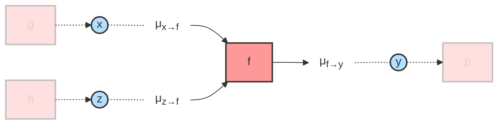

# [Rule Not Found Error](@id rule-not-found)

When using RxInfer, you might encounter a `RuleNotFoundError`. This error occurs during message-passing inference when the system cannot find appropriate update rules for computing messages between nodes in your factor graph. Let's understand why this happens and how to resolve it.

## Why does this happen?

Message-passing inference works by exchanging messages between nodes in a factor graph. Each message represents a probability distribution, and the rules for computing these messages depend on:

1. The type of the factor node (e.g., `Normal`, `Gamma`, etc.)
2. The types of incoming messages (e.g., `Normal`, `PointMass`, etc.) 
3. The interface through which the message is being computed
4. The inference method being used (Belief Propagation or Variational Message Passing), and the node's algorithm

The fourth point is particularly important - some message update rules may exist for Variational Message Passing (VMP) but not for Belief Propagation (BP), or vice versa. This is because BP aims to compute exact posterior distributions through message passing (when possible), while VMP approximates the posterior using the Bethe approximation. For a detailed mathematical treatment of these differences, see our [Bethe Free Energy implementation](@ref lib-bethe-free-energy) guide.

For example, consider this simple model:

```@example rule-not-found
using RxInfer

@model function problematic_model(y)
    μ ~ Normal(mean = 0.0, variance = 1.0)
    τ ~ Gamma(shape = 1.0, rate = 1.0)
    y ~ Normal(mean = μ, precision = τ)
end
```

Inference with belief propagation, the default, fails with a `RuleNotFoundError`:

```@example rule-not-found
try
    infer(
        model = problematic_model(),
        data = (y = 1.0,),
        disable_inference_error_hint = true, #hide
    )
catch err
    showerror(stdout, err)
end
```

There are no belief propagation message update rules for this combination of distributions, only variational message passing rules. Even though the model looks simple, the messages needed for exact inference do not exist in closed form.

## [Reading the error](@id rule-not-found-reading)

The [`RuleNotFoundError`](@extref MessagePassingRulesBase.RuleNotFoundError) above is a report in four parts:

1. **The first line** names the node (`NormalMeanPrecision`), the edge the message is computed for (`:μ`), the node's [algorithm](@extref MessagePassingRulesBase glossary-algorithm) and the inputs the engine offered: here the message `m[:τ]` from the `Gamma` prior and the marginal `q[:out]` of the observation. `m[:x]` is a [message](@extref MessagePassingRulesBase glossary-message) arriving on edge `x`, and `q[:x]` a [marginal](@extref MessagePassingRulesBase glossary-marginal).
2. **The diagnosis** says why nothing matched.
3. **The `what to try` line** suggests the change that addresses the diagnosis.
4. **The near misses** list the node's rules for this edge, each with its inputs marked: `✓` for an input that matches, `✗ … not provided` for an input the rule needs and did not get, `✗ … got T` for an input of the wrong type, and `✗ … provided but not consumed` for an input the engine offered and the rule does not take.

The diagnosis and its `what to try` line take one of four forms:

| Diagnosis | What to try |
|:----------|:------------|
| no rule exists for this node and target under any algorithm | load the package that defines the node's rules, or define the rule |
| a rule of this shape exists, but the input types do not fit | project the inputs onto a family the rule takes with a form constraint in `@constraints`, or define a rule for these types |
| rules of this shape exist under another algorithm | give the node that algorithm (see [Algorithm specification](@ref user-guide-algorithm-specification)) |
| no rule consumes this set of inputs under this algorithm | change the factorization in `@constraints`, which decides whether a rule receives a message or a marginal on each edge, or define a rule for these inputs |

In the example, the diagnosis is the last one. Two of the near misses take `q[:out]` and `q[:τ]`: the marginal of `τ` where the engine offered its message. A mean-field factorization `q(μ, τ) = q(μ)q(τ)` delivers exactly that (see [Use variational inference](@ref rule-not-found-solutions-vmp) below).

## Common scenarios

You're likely to encounter this error when:

1. Using non-conjugate pairs of distributions (e.g., `Beta` prior with `Normal` likelihood with precision parameterization)
2. Working with custom distributions or factor nodes without defining all necessary update rules
3. Using complex transformations between variables that don't have defined message computations
4. Mixing different types of distributions in ways that don't have analytical solutions

## Design Philosophy

RxInfer prioritizes performance over generality in its message-passing implementation. By default, it only uses analytically derived message update rules, even in cases where numerical approximations might be possible. This design choice:

- Ensures fast and reliable inference when rules exist
- Avoids potential numerical instabilities from approximations
- Throws an error when analytical solutions don't exist

This means you may encounter `RuleNotFoundError` even in cases where approximate solutions could theoretically work. This is intentional - RxInfer will tell you explicitly when you need to consider alternative approaches rather than silently falling back to potentially slower or less reliable approximations. See the [Solutions](@ref rule-not-found-solutions) section below for more details.

## Visualizing the message passing graph

To better understand where message passing rules are needed, let's look at a simple factor graph visualization:



In this example:
- Variables (`x`, `y`, `z`) are represented as circles
- The factor node (`f`) is represented as a square
- Messages (μ) flow along the edges between variables and factors, with subscripts indicating direction (e.g., x→f flows from x to f)
- Faded nodes (g, h) represent other parts of the factor graph that aren't relevant for this local message computation

To compute the outgoing message `f→y`, RxInfer needs:
1. Rules for how to process incoming messages `x→f` and `z→f`
2. Rules for combining these messages based on the factor `f`'s type
3. Rules for producing the outgoing message type that `y` expects

A `RuleNotFoundError` occurs when any of these rules are missing. For example, if `x` sends a `Normal` message but `f` doesn't know how to process `Normal` inputs, or if `f` can't produce the type of message that `y` expects.

## [Solutions](@id rule-not-found-solutions)

### 1. Convert to conjugate pairs

First, try to reformulate your model using conjugate prior-likelihood pairs. Conjugate pairs have analytical solutions for message passing and are well-supported in RxInfer. For example, instead of using a `Normal` likelihood with `Beta` prior on its precision, use a `Normal-Gamma` conjugate pair. See [Conjugate prior - Wikipedia](https://en.wikipedia.org/wiki/Conjugate_prior#Table_of_conjugate_distributions) for a comprehensive list of conjugate distributions.

### 2. Check available rules

If conjugate pairs aren't suitable, verify if your combination of distributions and message types is supported. RxInfer provides many predefined rules, but not all combinations are possible. The rules of the standard nodes are documented on the site of [`StandardMessagePassingRules`](@extref StandardMessagePassingRules StandardMessagePassingRules), and every other node has a package and a site of its own, listed on [ReactiveMP's ecosystem page](@extref ReactiveMP ecosystem-nodes). A node from one of those packages needs the package loaded, for example `using ProbitMessagePassingRules`.

You can also ask for the rules directly. [`MessagePassingRulesBase.rule_coverage`](@extref) lists, per edge and algorithm, how many rules a node has:

```@example rule-not-found
MessagePassingRulesBase.rule_coverage(NormalMeanPrecision)
```

[`MessagePassingRulesBase.which_message_update_rule`](@extref) shows which rule would run for given inputs, the way the engine selects it:

```@example rule-not-found
MessagePassingRulesBase.which_message_update_rule(
    NormalMeanPrecision, :μ;
    q = (out = PointMass(1.0), τ = GammaShapeRate(1.0, 1.0)),
)
```

### 3. Create custom update rules

If you need specific message computations, you can define your own update rules. See [Creating your own custom nodes](@ref create-node) for a detailed guide on implementing custom nodes and their update rules.

### 4. Use approximations

When exact message updates aren't available, consider:

- Using simpler distribution pairs that have defined rules
- Choosing a node's approximation through its algorithm, as described in [Algorithm specification](@ref user-guide-algorithm-specification); a deterministic transformation takes `DeltaApproximation(method = Linearization())`, `Unscented()` or `CVIProjection()` (see [Deterministic nodes](@ref delta-node-manual))
- Passing `options = (rulefallback = NodeFunctionRuleFallback(),)` to [`infer`](@ref): where no rule matches, a stochastic node sends its own log-density with every other input collapsed to its mean, an unnormalized [`NodeFunctionLogPdf`](@extref MessagePassingRulesBase.NodeFunctionLogPdf); a functional form constraint (see [Built-in Functional Forms](@ref lib-forms)) turns the resulting posterior into a proper distribution

### [5. Use variational inference](@id rule-not-found-solutions-vmp)

Sometimes, adding appropriate factorization constraints can help avoid problematic message computations:

```@example rule-not-found
constraints = @constraints begin
    q(μ, τ) = q(μ)q(τ)  # Mean-field assumption
end

result = infer(
    model = problematic_model(),
    data = (y = 1.0,),
    constraints = constraints,
    initialization = @initialization(q(τ) = GammaShapeRate(1.0, 1.0)),
    iterations = 10,
)

result.posteriors[:μ][end]
```

!!! note
    When using variational constraints, you will likely need to initialize certain messages or marginals to handle loops in the factor graph. See [Initialization](@ref initialization) for details on how to properly initialize your model.

For more details on constraints and variational inference, see:

- [Constraints Specification](@ref user-guide-constraints-specification) for a complete guide on using constraints
- [Bethe Free Energy](@ref lib-bethe-free-energy) for the mathematical background on variational inference and message passing

## Implementation details

When RxInfer encounters a missing rule, it means one of these is missing:

1. A message update rule for the specific message direction and input types, declared with [`@define_message_update_rule`](@extref MessagePassingRulesBase.@define_message_update_rule)
2. A marginal update rule for computing joint marginals, declared with [`@define_marginal_update_rule`](@extref MessagePassingRulesBase.@define_marginal_update_rule)
3. An average energy for free energy computation, declared with [`@define_average_energy`](@extref MessagePassingRulesBase.@define_average_energy)

For an explanation of what rules are and how they work, see [Understanding Rules](@ref what-is-a-rule). You can add these using the methods described in [Creating your own custom nodes](@ref create-node).

!!! note
    Not all message-passing rules have analytical solutions. In such cases, you might need to use numerical approximations or choose different model structures.

